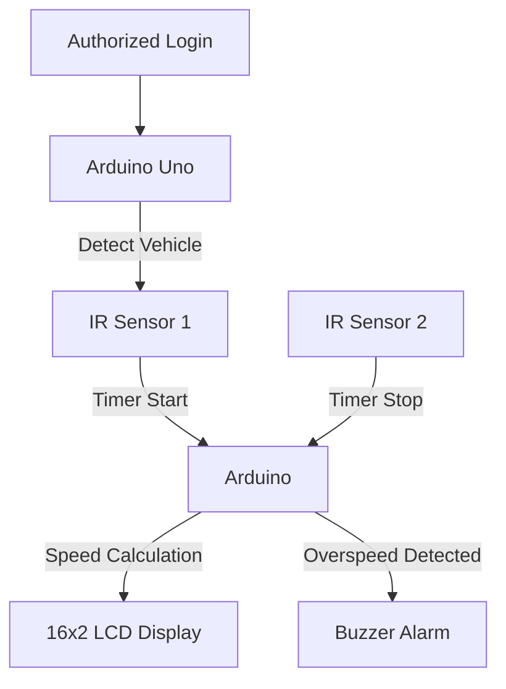

# 🚗 Vehicle Speed Checker – Arduino & IR Sensor Based System

*"Affordable IoT-based Speed Detection for Safer Roads"*

---

## 📌 Project Overview
The **Vehicle Speed Checker** is an embedded system designed to **monitor vehicle speed** in real time using an Arduino Uno microcontroller, IR sensors, LCD display, and a buzzer alarm.  
The system provides an **instant alert** if a vehicle exceeds the predefined speed limit (e.g., 50 km/h).  

Unlike expensive radar-based systems, this project demonstrates a **low-cost, portable, and educational prototype** that can be deployed in school zones, highways, and checkpoints to improve road safety.

---

## 🎯 Motivation
Over speeding is a major cause of road accidents, especially in developing countries like Bangladesh.  
Existing radar/camera systems are costly and difficult to implement.  
This project was motivated by the need for a **low-cost, Arduino-based system** that ensures road safety while being affordable and easy to replicate.

---

## 🏆 Objectives
- Develop a **microcontroller-based** speed measurement system.  
- Add **login authentication** for secure access.  
- Calculate vehicle speed using **two IR sensors** placed at a fixed distance.  
- Display speed on a **16×2 I²C LCD screen**.  
- Trigger a **buzzer alarm** for over speeding.  
- Ensure **low cost, portability, and replicability** for educational and practical use.  

---

## ⚙️ System Design & Methodology

### 🔑 Functional Workflow
1. **Login Authentication** → Only authorized users can start the system.  
2. **IR Sensors** → Two sensors detect vehicle entry & exit across a fixed distance.  
3. **Arduino Processing** → Time difference is calculated.  
4. **Speed Calculation Formula**  

```
Speed (km/h) = (Distance (m) ÷ Time (s)) × 3.6
```

5. **LCD Display** → Shows speed results and alerts.  
6. **Buzzer Alert** → Sounds alarm if speed exceeds threshold.  

### 🔄 Workflow Diagram


---

## 🔩 Hardware Components
- **Arduino Uno** – Microcontroller for processing.  
- **2 × IR Sensors** – Detect vehicle passage.  
- **16×2 LCD with I²C Module** – Display speed and alerts.  
- **Buzzer** – Audible overspeed warning.  
- **Breadboard & Jumper Wires** – Circuit prototyping.  

---

## 🛠️ Project Folder Structure

```bash
Vehicle-Speed-Checker/
├── arduino_code/           # Arduino sketches (.ino files)
├── docs/                   # Documentation, report, diagrams
│   ├── screenshots/        # Photos of circuit & results
│   └── diagrams/           # Circuit diagrams, workflow charts
├── hardware/               # Circuit design and component details
├── results/                # Test case results, logs
└── README.md
```

---

## 🖼️ Circuit Diagram & UI Design
The system uses **IR sensors** connected to Arduino pins (A0, A1), a buzzer on **digital pin 13**, and LCD with I²C on **SDA=A4, SCL=A5**.  
The LCD shows messages like:  

- *“Access Granted – System Starting…”*  
- *“Vehicle Speed = 41.5 Km/Hr – Normal”*  
- *“ALERT: Vehicle Speed = 144.0 Km/Hr – OVER SPEEDING!”*  

---

## 📊 Implementation & Results

### Test Case 1: Unauthorized Login  
Input: Wrong username & password → *Access Denied*  

### Test Case 2: Authorized Login  
Input: Correct credentials → *Access Granted – System Starting…*  

### Test Case 3: Normal Speed  
- Distance = 10m, Time = 0.87s → Speed ≈ 41.5 km/h  
- Result: *Normal Speed* (No buzzer).  

### Test Case 4: Overspeed Example  
- Distance = 10m, Time = 0.25s → Speed = 144 km/h  
- Result: *ALERT + Buzzer ON*.  

---

## 🌍 Social & Environmental Impact
- **Road Safety** → Reduces accident risks by alerting overspeeding.  
- **Law Enforcement** → Helps traffic police at checkpoints.  
- **Environmental Benefits** → Prevents fuel wastage, reduces emissions, and lowers noise pollution.  
- **Educational Value** → Demonstrates microcontroller, sensors, and IoT applications.  

---

## 🚀 Future Improvements
- Rugged, weatherproof design.  
- Configurable speed threshold via LCD/Keypad.  
- Data logging with SD card/RTC.  
- Wireless connectivity (Bluetooth/Wi-Fi).  
- Multi-lane monitoring.  
- Integration with smart traffic systems.  

---

## 👨‍💻 Team Members
- Abdullah Al Noman (221-15-5387)  
- Nushrat Jahan Mila (221-15-5758)  
- Abrar Hameem Bornil (221-15-5331)  
- Mostafizur Rahman (221-15-5316)  
- Khatmoon Nur Maharu (221-15-5421)  

---

## 🏫 Institution
**Daffodil International University (DIU)**  
Department of Computer Science & Engineering  
Course: **CSE234 – Embedded Systems and IoT Lab**  

---

## 📜 License
This project is released under the **MIT License**.  

---

## 🙌 Acknowledgements
We sincerely thank **Kazi Hasibur Rahman (Lecturer, DIU)** for his valuable guidance and supervision during this project.  

---
